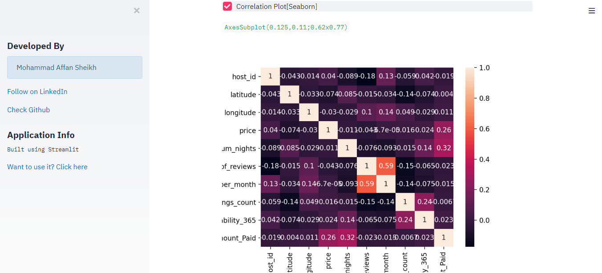
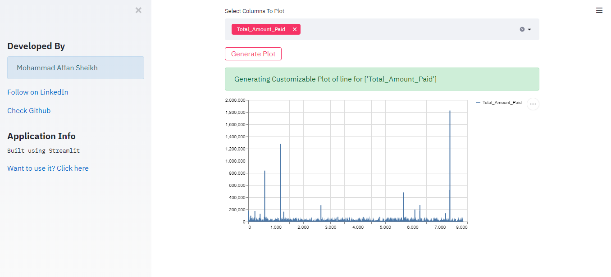

# ExplorAid
Exploratory Data Analysis Tool 

#### This Application requires:
1. Streamlit (pip install streamlit)
2. Python3
3. Text Editor (I use Sublime Text)

## How to get this Application on your Computer?

* Clone this repository on your PC:

#### 	git clone https://github.com/Affansheikh21/ExplorAid.git

* Open Command Prompt and change the path to current directory

* Write the following command:

#### 	streamlit run app.py
* Copy the given ip address on your browser

Example:
#### Local URL: http://localhost:8501
#### Network URL: http://192.168.0.105:8501

### Make sure you put your dataset into the datasets folder inside the repository. 

### Demo

